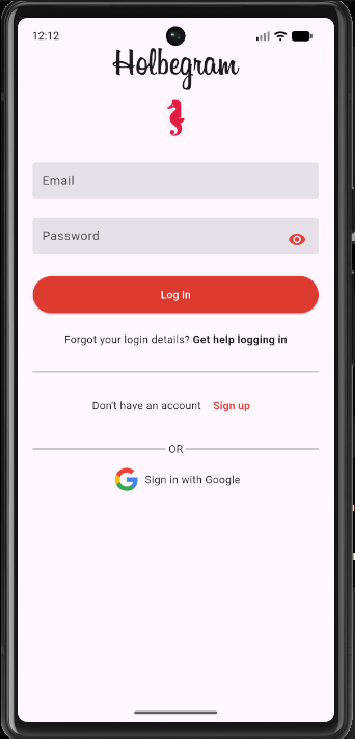
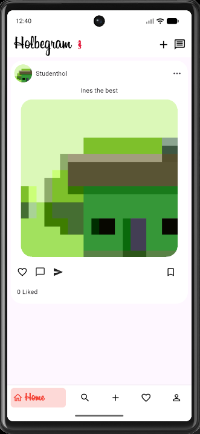
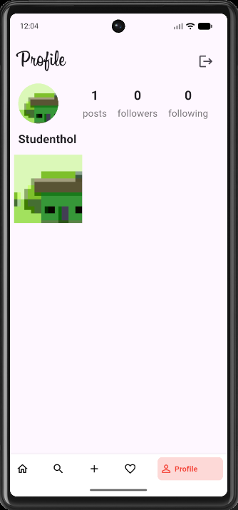

# Holbegram

<p align="center">
  
</p>

<h2 align="center">A Flutter social media app inspired by Instagram</h2>

<p align="center">
  
  
  
  
  
</p>

---

## Overview

**Holbegram** is a Flutter mobile application inspired by Instagram.  
It allows users to:

- create an account
- log in securely
- upload a profile picture
- create posts with captions
- browse posts in a feed
- explore images in search
- save favorite posts
- view their personal profile
- log out

This project was built using **Flutter**, **Firebase Authentication**, **Cloud Firestore**, **Cloudinary**, and **Provider**.

---

## Features

### Authentication
- Sign up with email and password
- Log in with Firebase Authentication
- Upload a profile picture during registration
- Store user data in Cloud Firestore

### Home Feed
- Display all published posts
- Show profile image, username, caption, and post image
- Show likes count
- Delete posts

### Add Post
- Select an image from gallery or camera
- Write a caption
- Upload the image to Cloudinary
- Save post data in Firestore

### Search Page
- Display uploaded post images
- Explore visual content in a grid layout

### Favorite Page
- Save a post using the bookmark icon
- Remove a post from favorites
- Display all saved posts

### Profile Page
- Show user profile image and username
- Show posts count, followers, and following
- Display the user’s posts in a grid
- Log out from the application

---

## Tech Stack

- **Flutter**
- **Dart**
- **Firebase Authentication**
- **Cloud Firestore**
- **Cloudinary**
- **Provider**
- **Image Picker**
- **HTTP**
- **UUID**

---

## Project Structure

```bash
holbertonschool-holbegram/
└── holbegram/
    ├── lib/
    │   ├── main.dart
    │   ├── methods/
    │   │   └── auth_methods.dart
    │   ├── models/
    │   │   ├── user.dart
    │   │   └── post.dart
    │   ├── providers/
    │   │   └── user_provider.dart
    │   ├── screens/
    │   │   ├── home.dart
    │   │   ├── login_screen.dart
    │   │   ├── signup_screen.dart
    │   │   ├── upload_image_screen.dart
    │   │   ├── auth/
    │   │   │   └── methods/
    │   │   │       └── user_storage.dart
    │   │   └── pages/
    │   │       ├── feed.dart
    │   │       ├── search.dart
    │   │       ├── add_image.dart
    │   │       ├── favorate.dart
    │   │       ├── profile_screen.dart
    │   │       └── methods/
    │   │           └── post_storage.dart
    │   ├── utils/
    │   │   └── posts.dart
    │   └── widgets/
    │       ├── bottom_nav.dart
    │       └── text_field.dart
    ├── assets/
    │   ├── fonts/
    │   └── images/
    ├── android/
    ├── ios/
    ├── web/
    ├── pubspec.yaml
    └── README.md
```

---

## Firebase Configuration

This project uses Firebase for authentication and database management.

### Services Used
- **Firebase Authentication**
  - Email/Password provider
- **Cloud Firestore**
  - `users` collection
  - `posts` collection

### Setup Steps
Make sure you:

1. create a Firebase project
2. add an Android app
3. enable **Email/Password** in Authentication
4. create a **Cloud Firestore** database
5. download `google-services.json`
6. place it inside:

```bash
android/app/google-services.json
```

---

## Cloudinary Configuration

Cloudinary is used to upload and store images.

Update the Cloudinary configuration inside:

```dart
lib/screens/auth/methods/user_storage.dart
```

Example:

```dart
final String cloudinaryUrl =
    "https://api.cloudinary.com/v1_1/YOUR_CLOUD_NAME/image/upload";
final String cloudinaryPreset = "YOUR_UPLOAD_PRESET";
```

---

## Installation

### Clone the repository

```bash
git clone https://github.com/Ines-Oubabas/holbertonschool-holbegram.git
cd holbertonschool-holbegram/holbegram
```

### Install dependencies

```bash
flutter pub get
```

### Run the app

```bash
flutter run
```

### Analyze the project

```bash
flutter analyze
```

---

## Main Screens

- Login Screen
- Sign Up Screen
- Upload Profile Picture Screen
- Home Page
- Feed Page
- Search Page
- Add Image Page
- Favorite Page
- Profile Page

---

## Data Models

### User Model
The user model contains:

- `uid`
- `email`
- `username`
- `bio`
- `photoUrl`
- `followers`
- `following`
- `posts`
- `saved`
- `searchKey`

### Post Model
The post model contains:

- `caption`
- `uid`
- `username`
- `likes`
- `postId`
- `datePublished`
- `postUrl`
- `profImage`

---

## Functional Highlights

- Authentication with Firebase
- User registration with profile image
- Provider-based user state management
- Upload posts with captions
- Dynamic feed from Firestore
- Save and unsave favorite posts
- Profile statistics and grid view
- Logout support

---

## Packages Used

```yaml
dependencies:
  flutter:
    sdk: flutter
  firebase_core:
  firebase_auth:
  cloud_firestore:
  provider:
  image_picker:
  http:
  uuid:
```

---

## Final Status

This project was completed up to:

- User authentication
- Profile picture upload
- Firestore integration
- Cloudinary integration
- Feed page
- Add post page
- Search page
- Favorite page
- Profile page
- Logout feature

---

## Screenshots

> You can add your screenshots here later.

Example:

```md
## App Preview




```

---

## Author

**Ines Oubabas**

- GitHub: [Ines-Oubabas](https://github.com/Ines-Oubabas)
- Project repository: [holbertonschool-holbegram](https://github.com/Ines-Oubabas/holbertonschool-holbegram)

---

## Notes

- Firebase and Cloudinary must be configured correctly before running the project
- Internet connection is required for online image loading and remote storage
- The project was tested successfully with:

```bash
flutter analyze
```